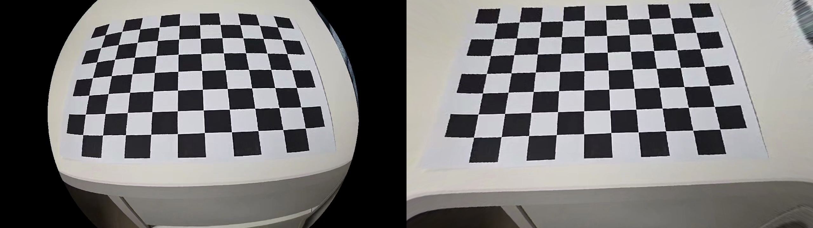

# Glasses-For-Fish


체스보드 영상을 이용해 카메라를 캘리브레이션하고, 추정한 파라미터로 렌즈 왜곡을 보정한 결과를 정리한 프로젝트입니다.

## 실험 설정

- 입력 영상: `checker.mp4`
- 선택된 캘리브레이션 이미지 수: `21장`
- 체스보드 내부 코너 수: `10 x 7`
- 모델 선택 기준: `AIC`

이미지 선택은 [image_sampling.py](image_sampling.py)로 수행했고, 캘리브레이션 및 모델 선택은 [cam_cali_select.py](cam_cali_select.py), 왜곡 보정은 [distortion_correction.py](distortion_correction.py)로 수행했습니다.

## Camera Calibration Result

카메라 캘리브레이션은 선택된 체스보드 이미지 `21장`으로 수행했습니다. 모델 선택 결과 가장 좋은 조합은 `P4 + BC4`였고, 최종 reprojection RMSE는 `0.7374851483247663`입니다.

| 항목 | 값 |
| --- | ---: |
| Projection model | `P4` |
| Distortion model | `BC4` |
| `fx` | `1052.4783195665802` |
| `fy` | `1060.8481063803451` |
| `cx` | `642.6012558667876` |
| `cy` | `386.2662449890409` |
| `k1` | `-0.6506286768418007` |
| `k2` | `-0.1678206480314486` |
| `p1` | `-0.014427371841973255` |
| `p2` | `-0.001000632360821689` |
| `k3` | `0.0` |
| RMSE | `0.7374851483247663` |

추정된 camera matrix는 다음과 같습니다.

```text
[[1052.4783195665802,    0.0,              642.6012558667876],
 [   0.0,              1060.8481063803451, 386.2662449890409],
 [   0.0,                 0.0,               1.0]]
```

추정된 distortion coefficients는 다음과 같습니다.

```text
[[-0.6506286768418007, -0.1678206480314486, -0.014427371841973255, -0.001000632360821689, 0.0]]
```

캘리브레이션 결과 파일은 실행 시 `results.json`에 저장됩니다.

## Lens Distortion Correction

왜곡 보정은 캘리브레이션 결과의 `K`와 `dist_coef`를 사용해 수행했습니다. 아래 이미지는 `sampled_images/img_1.jpg`에 대해 원본과 보정 결과를 좌우로 붙여서 저장한 데모입니다.

왼쪽: 원본 이미지  
오른쪽: 왜곡 보정 결과



보정은 `cv.getOptimalNewCameraMatrix`와 `cv.undistort`를 이용해 수행했습니다. 왼쪽 원본과 비교했을 때, 오른쪽 보정 결과에서 렌즈 왜곡이 완화된 것을 확인할 수 있습니다.

동일한 캘리브레이션 결과를 전체 영상에도 적용했습니다.

[왜곡 보정 영상 데모 보기](outputs/undistorted_video.mp4) outputs/undistorted_video.mp4 파일 입니다.

## 실행 방법

의존성 설치:

```bash
pip install -r requirements.txt
```

1. 영상에서 캘리브레이션 이미지 선택

```bash
python image_sampling.py checker.mp4 sampled_images
```

2. 카메라 캘리브레이션 및 모델 선택

```bash
python cam_cali_select.py sampled_images results.json -c cfgs/cam_cali_select.json
```

3. 결과 시각화

```bash
python visualize.py results.json -t model_wise_score -c cfgs/visualize.json
python visualize.py results.json -t point_wise -c cfgs/visualize.json
python visualize.py results.json -t cam_pose -c cfgs/visualize.json
```

4. 단일 이미지 왜곡 보정

```bash
python distortion_correction.py sampled_images/img_1.jpg outputs/undistorted_demo.jpg -r results.json --side_by_side
```

5. 전체 영상 왜곡 보정

```bash
python distortion_correction.py checker.mp4 outputs/undistorted_video.mp4 -r results.json --side_by_side
```
